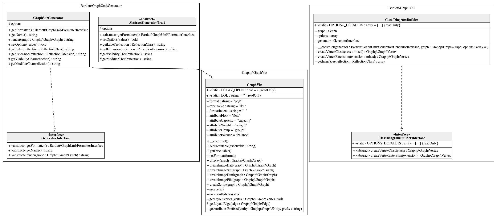

# Multiple classes diagram

```php
<?php
use Bartlett\GraphUml;

use Graphp\Graph\Graph;
use Graphp\GraphViz\GraphViz;

$generator = new GraphUml\Generator\GraphVizGenerator(new GraphViz());
$graph = new Graph();
$builder = new GraphUml\ClassDiagramBuilder(
    $generator,
    $graph,
    [
        'label_format' => 'html',
    ]
);

$builder->createVertexClass(GraphUml\Generator\GraphVizGenerator::class);
$builder->createVertexClass(GraphUml\ClassDiagramBuilder::class);

// show UML diagram statements
echo $generator->createScript($graph);
// default format is PNG
echo $generator->createImageFile($graph) . ' file generated' . PHP_EOL;
```

Will output this [graph statements](./multiple_classes.html.gv).

And temporary png file generated look like :


