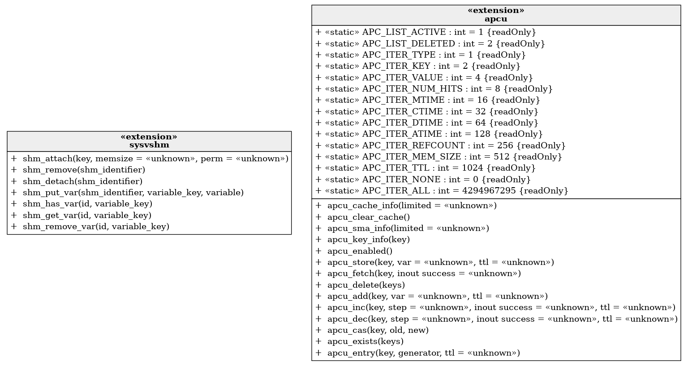

```php
use Bartlett\GraphUml\ClassDiagramBuilder;
use Bartlett\GraphUml\Generator\GraphVizGenerator;

use Graphp\Graph\Graph;
use Graphp\GraphViz\GraphViz;

$generator = new GraphVizGenerator(new GraphViz());
$graph = new Graph();
$builder = new ClassDiagramBuilder(
    $generator,
    $graph,
    [
        'label-format' => 'html',
    ]
);

$extensions = get_loaded_extensions(false);

// adding all extensions will result in a huge graph, so just pick 2 random ones
shuffle($extensions);
$extensions = array_slice($extensions, 0, 2);

foreach ($extensions as $extension) {
    $builder->createVertexExtension($extension);
}

// show UML diagram statements
echo $generator->createScript($graph);
// default format is PNG
echo $generator->createImageFile($graph) . ' file generated' . PHP_EOL;
```

Will output this [graph statements](./php_extensions.html.gv).

And temporary png file generated look like :


